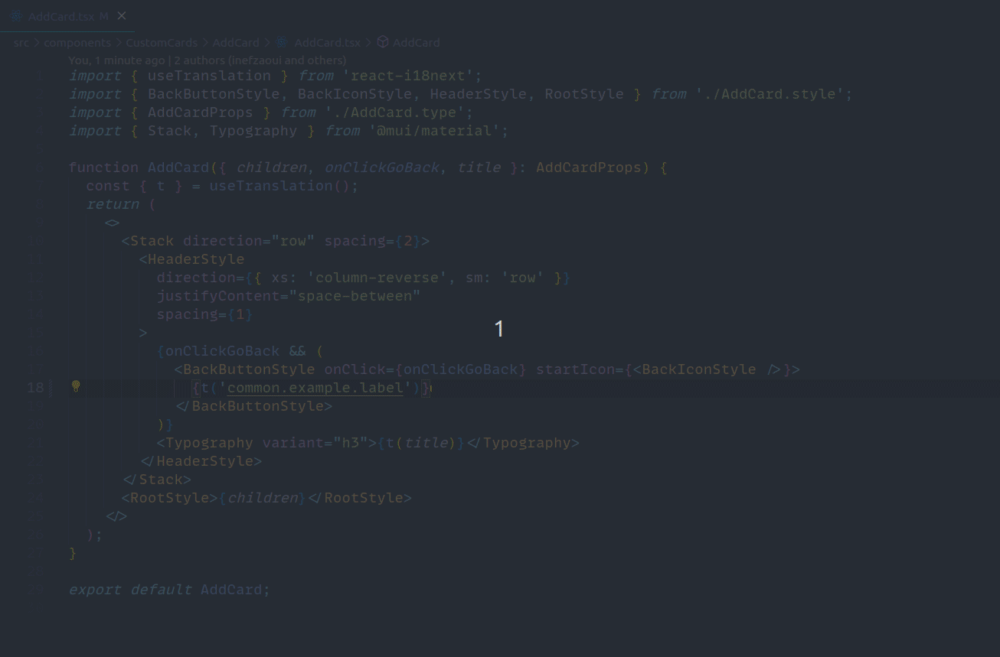

# i18n-goto

## How to use

[//]: # "## Known Issues"

## Settings

### regex

Custom regex for matching strings.

## Release Notes

### 0.1.0

- Initial release.
- Goes to file containing `ctrl+click`'ed label.

---

### 0.2.0

- Goes to the specific line of the label.
- Code refactor / bug fixes.

---

### 0.3.0

- Goes to the specific line of the label.
- Code refactor / bug fixes.

---
